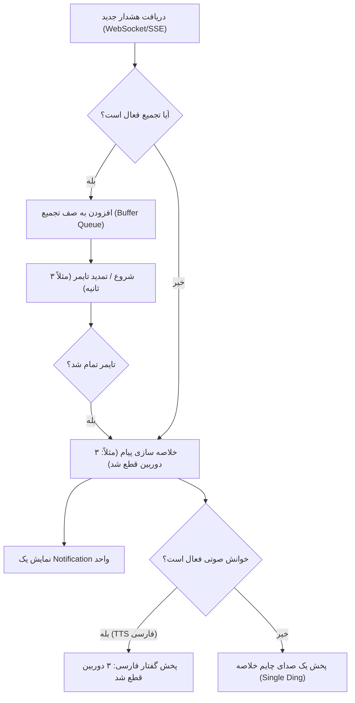

گزارش امکان‌سنجی فنی، طرح‌های پیشنهادی و سوالات مربوط به **تجمیع اعلان‌های مرورگر (Notification Batching)** و **خوانش صوتی فارسی (Persian TTS)** در سامانه **HikStatus** به شرح زیر آماده شده است:

---

## 📑 ۱. امکان‌سنجی فنی (Feasibility Study)

با بررسی کدهای بخش فرانت‌اند سامانه ([ui.js](file:///c:/Users/Mehdi/docker/HikStatus/static/js/ui.js#L1601-L1626))، مشخص گردید که در حال حاضر با دریافت هر پیام از طریق WebSocket/SSE، تابع `handleIncomingAlert` بلافاصله اقدام به ساخت یک `Notification` جدید و پخش صدای چایم صوتی می‌نماید. در زمان قطعی شبکه یا برق که چندین دوربین به یکباره قطع می‌شوند، این عملکرد باعث پخش رگباری صدا (Audio Bursting) و انباشت اعلان‌ها می‌شود.

این قابلیت **به طور ۱۰۰٪ امکان‌پذیر** است و شامل دو بخش اصلی زیر می‌باشد:

### الف) تجمیع و زمان‌بندی اعلان‌ها (Notification Debouncing & Aggregation)
* **امکان‌پذیری:** **کاملاً عملی و سبک**
* **روش پیاده‌سازی:** به جای پخش آنی هر هشدار، یک «صف با بازه زمانی شناور» (Buffer Window به مدت ۳ تا ۵ ثانیه) در فرانت‌اند ایجاد می‌شود. تمام هشدارهای دریافتی در این بازه جمع‌آوری، شمارش و طبقه‌بندی شده و پس از پایان بازه، **تنها یک اعلان تجمیعی** (مثلاً: *«۳ دوربین و ۱ دستگاه NVR قطع شدند»*) ارسال و خوانده می‌شود.

> [!question] تصمیم
> چون این سیستم طوری طراحی شده که هر 60 ثانیه یکبار بررسی میکنه که دوربین ها قطع شدن یا نه پس نیازی به صف با بازه زمانی شناور نیست
> حتی سیستم اعلان های تلگرام و ایمیل هم سیستم تجمیع اعلان و تاخیر داره که میتونیم از اون هم استفاده کنیم تا پردازش بهینه تر بشه و از کد های تکراری جلوگیری بشه

### ب) خوانش صوتی اعلان‌ها به زبان فارسی (Persian Text-to-Speech)
* **امکان‌پذیری:** **عملی به همراه چند راهکار پشتیبان (Fallback)**
* **مکانیسم‌های پیاده‌سازی:**
  1. **روش اصلی (Web Speech API):** استفاده از API نیتیو مرورگر (`window.speechSynthesis`) با کد زبان `fa-IR`. مرورگرهای جدید (مانند Chrome, Edge, Safari و Android) در ویندوز ۱۰/۱۱ و موبایل، موتور خوانش صوتی فارسی (مانند صداهای نیورال *Dilara* و *Farid* در Microsoft Edge) را دارا هستند.
  2. **روش پشتیبان (Audio Sprites / پکیج صوتی هوشمند):** برای مرورگرها یا سیستم‌عامل‌های قدیمی که وویس فارسی ندارند، می‌توان ترکیبی از فایل‌های صوتی کوچک (اعداد فارسی + کلمات کلیدی مثل «دوربین»، «دستگاه NVR»، «قطع شد»، «ارتباط برقرار شد») را به صورت زنجیره‌ای به یکدیگر متصل و پخش نمود.

---

## 🎨 ۲. طرح‌های پیشنهادی معماری و UX

### 💡 طرح پیشنهادی اصلی (ترکیبی و هوشمند):
1. **لایه تجمیع زمانی (Aggregation Layer):**
   * اضافه شدن یک `NotificationAggregator` در فرانت‌اند ([ui.js](file:///c:/Users/Mehdi/docker/HikStatus/static/js/ui.js)).
   * اگر ظرف مدت ۳ ثانیه فقط ۱ رویداد بیاید: *«دوربین ورودی اصلی قطع شد»*
   * اگر چند رویداد همزمان بیاید: *«۳ دوربین در کارخانه شماره ۱ قطع شدند»*
2. **لایه خوانش صوتی (Persian Speech Synthesizer):**
   * تبدیل اعداد به حروف فارسی روان (۱ -> یک، ۳ -> سه).
   * خوانش هوشمند بر اساس نوع رویداد (قطع / وصل / خطای دیسک).
   * امکان انتخاب بین صدای چایم ساده و گوینده فارسی.
3. **لایه تنظیمات در پنل (User Notification Settings):**
   * کلید فعال/غیرفعال‌سازی **تجمیع اعلان‌ها**.
   * تنظیم **مدت زمان بازه تجمیع** (بین ۲ تا ۱۰ ثانیه).
   * کلید **خوانش صوتی فارسی (TTS)** با امکان تست آنلاین صدا.

---

## ❓ ۳. سوالات شفاف‌سازی و دریافت تایید

لطفاً جهت نهایی‌سازی طرح و شروع پیاده‌سازی، نظرتان را درباره موارد زیر مشخص فرمایید:

1. **مدت زمان بازه تجمیع:** آیا زمان پیش‌فرض **۳ ثانیه** برای جمع‌آوری هشدارهای هم‌زمان مناسب است یا مقدار دیگری (مثلاً ۵ ثانیه) مد نظر دارید؟
2. **پشتیبانی از مرورگرهای بدون موتور TTS فارسی:** در صورتی که مرورگر کاربر از گوینده فارسی پشتیبانی نکند، آیا تمایل دارید سیستم به صورت خودکار به **«پخش یک صدای چایم خلاصه‌ای کوتاه»** تغییر حالت دهد، یا مایلید **فایل‌های صوتی ضبط شده فارسی (Audio Sprites)** اضافه شوند؟
3. **محدوده خوانش صوتی:** آیا خوانش صوتی فقط برای هشدارهای **قطعی/بحرانی (Critical/Error)** انجام شود یا برای هشدارهای **وصل مجدد (Recovery/Success)** نیز خوانده شود؟ (مثلاً: *«ارتباط ۲ دوربین برقرار شد»*)

پس از تایید شما، برنامه اجرایی تدوین شده و تغییرات در کد اعمال خواهند شد.