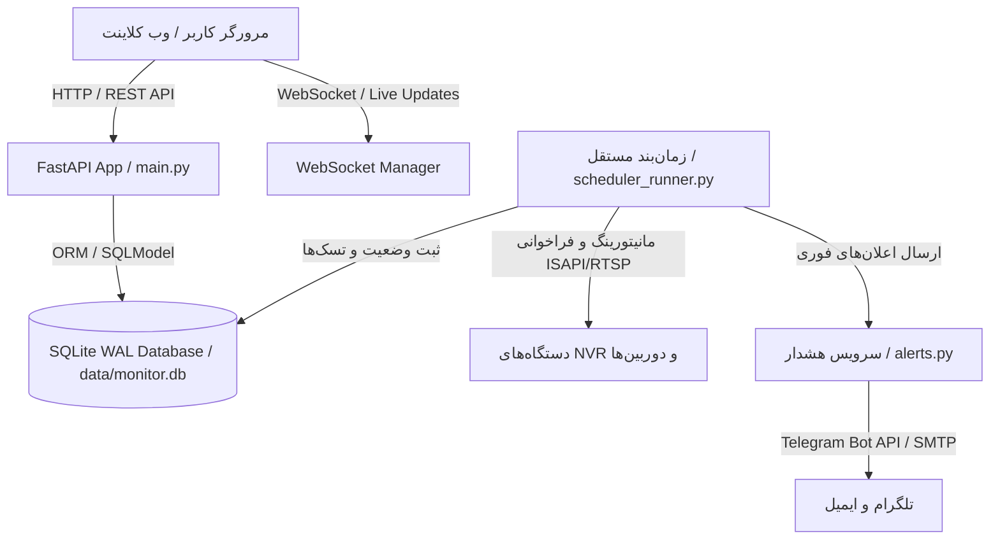

# 🗺️ نقشه معماری و کدبیس پروژه HikStatus (CODEBASE_MAP)

این مستند نقشه جامع ماژول‌ها، ساختار فایل‌های بک‌اند و فرانت‌اند، و نحوه تعامل بخش‌های مختلف سامانه **HikStatus** را تشریح می‌کند.

---

## 🏗️ ۱. معماری کلی سیستم (High-Level Architecture)

سیستم به صورت تفکیک‌شده از دو پروسه اصلی پایتون تشکیل شده است:
1. **وب‌سرور اصلی (Web Server):** اجرا بر بستر FastAPI و Uvicorn (`app/main.py`) که مدیریت APIها، نشست‌های کاربران، وب‌سوکت و لایه ارائه را بر عهده دارد.
2. **زمان‌بند مستقل (Background Scheduler):** اجرا در پروسه مجزا (`scheduler_runner.py`) که حلقه‌های پایش وضعیت، همگام‌سازی، آمارگیری و ارسال هشدارهای زمان‌بندی‌شده را انجام می‌دهد.

---

## 📁 ۲. ساختار پوشه‌ها و ماژول‌های بک‌اند (`app/`)

### ۲.۱. فایل‌های ریشه `app/`
* **[`app/main.py`](file:///c:/Users/Mehdi/projects/HikStatus/app/main.py):**
  - نقطه ورود اصلی سرور وب و شامل تمام اندپوینت‌های سیستم.
  - بخش‌های کلیدی:
    - **احراز هویت و نشست‌ها (Auth & Sessions):** `/api/login`, `/api/logout`, `/api/me`, `/api/users/*`, ۲FA TOTP.
    - **مدیریت تجهیزات (NVR & Cameras):** دریافت لیست، افزودن، ویرایش، حذف، تست اتصال، همگام‌سازی کانال‌ها.
    - **گروه‌ها و پلان‌ها (Groups & Map Plans):** مدیریت شعب، آپلود نقشه‌های تصویری و تنظیم موقعیت دوربین‌ها.
    - **لاگ‌ها و ممیزی (Audit Logs):** فیلتر و جستجوی ساختاریافته در رویدادها.
    - **تحلیل قطعی‌ها (Outages):** ثبت و بررسی دلایل قطعی (`OutageExplanation`).
    - **تسک‌های زمان‌بندی (Scheduler APIs):** فعال/غیرفعال کردن و اجرای دستی Taskها.
    - **تنظیمات و پشتیبان‌گیری (Settings & Backup):** ایمپورت/اکسپورت دیتابیس و کانفیگ‌ها.
* **[`app/database.py`](file:///c:/Users/Mehdi/projects/HikStatus/app/database.py):**
  - تعاریف جداول SQLModel، ایندکس‌ها، نگاشت‌ها، توابع هش و رمزنگاری گذرواژه‌ها (`Fernet`).
  - رجیستری و توابع مهاجرت دیتابیس (Migrations 001 to 015).
* **[`app/rate_limiter.py`](file:///c:/Users/Mehdi/projects/HikStatus/app/rate_limiter.py):**
  - سیستم محدودکننده نرخ درخواست‌ها (Rate Limiting) بر اساس آدرس IP یا توکن کاربر جهت محافظت در برابر حملات Brute-force و DoS.
* **[`app/logging_config.py`](file:///c:/Users/Mehdi/projects/HikStatus/app/logging_config.py):**
  - پیکربندی لاگر Loguru، چرخش لاگ‌ها (Rotation) و تابع ثبت ساختاریافته `log_event()`.
* **[`app/config.py`](file:///c:/Users/Mehdi/projects/HikStatus/app/config.py):**
  - متغیرهای محیطی، مسیر فایل‌ها و تنظیمات پایه پروژه.

---

### ۲.۲. سرویس‌های پس‌زمینه (`app/services/`)
* **[`app/services/monitor.py`](file:///c:/Users/Mehdi/projects/HikStatus/app/services/monitor.py):**
  - قلب تپنده مانیتورینگ؛ اجرای کوئری‌های وضعیت NVR و دوربین‌ها از طریق پروتکل ISAPI و سوکت TCP/RTSP.
  - تشخیص قطعی‌ها، وصل مجدد، ثبت رویدادهای `DowntimeEvent` و ارسال نوتیفیکیشن‌ها.
* **[`app/services/scheduler.py`](file:///c:/Users/Mehdi/projects/HikStatus/app/services/scheduler.py):**
  - زمان‌بند مبتنی بر APScheduler / Async Loops برای اجرای متناوب وظایف (مانیتورینگ، بررسی هاردها، خلاصه وضعیت و پاکسازی).
* **[`app/services/alerts.py`](file:///c:/Users/Mehdi/projects/HikStatus/app/services/alerts.py):**
  - موتور تولید پیام و ارسال هشدارهای تلگرام (با دکمه‌های شیشه‌ای و پشتیبانی از پروکسی) و ایمیل HTML با قالب‌های استاندارد فارسی و تاریخ شمسی.
  - پیاده‌سازی مکانیزم‌های صف‌بندی (Batching)، گلوگاه (Throttling) و نادیده‌گیری (Muting).
* **[`app/services/hikvision_service.py`](file:///c:/Users/Mehdi/projects/HikStatus/app/services/hikvision_service.py):**
  - لایه تجرید و ارتباط سطح پایین با دستگاه‌های هایک‌ویژن با Digest Authentication و استخراج XML.
* **[`app/services/camera_stats.py`](file:///c:/Users/Mehdi/projects/HikStatus/app/services/camera_stats.py):**
  - محاسبه آماری ساعات ضبط، وضعیت لاگ‌های محلی و سلامت استریم دوربین‌ها در بازه‌های ۲۴ ساعته.

---

## 🎨 ۳. ساختار و وظایف فرانت‌اند (`static/` و `templates/`)

فرانت‌اند به صورت کاملاً ماژولار با **Vanilla JavaScript**، بدون وابستگی به فریم‌ورک‌های سنگین پیاده‌سازی شده است:

### ۳.۱. فایل‌های اسکریپت (`static/js/`)
* **[`static/js/api.js`](file:///c:/Users/Mehdi/projects/HikStatus/static/js/api.js):**
  - لایه یکپارچه ارتباط با بک‌اند؛ تمامی توابع `fetch`، ارسال توکن، مدیریت خطاهای HTTP و دریافت دیتا از APIها در این فایل متمرکز است.
* **[`static/js/ui.js`](file:///c:/Users/Mehdi/projects/HikStatus/static/js/ui.js):**
  - کنترل‌کننده رابط کاربری، رندر کردن جداول، دیالوگ‌ها (Modals)، هشدارهای Toast، تب‌ها، کنترل فرم‌ها و تمپلیت‌های داینامیک.
* **[`static/js/main.js`](file:///c:/Users/Mehdi/projects/HikStatus/static/js/main.js):**
  - راه‌انداز اولیه اپلیکیشن، برقراری اتصال WebSocket، دریافت رویدادهای زنده و هدایت جریان برنامه.
* **[`static/js/login.js`](file:///c:/Users/Mehdi/projects/HikStatus/static/js/login.js):**
  - مدیریت فرم ورود، مرحله تأیید دو مرحله‌ای (2FA) و ذخیره توکن در نشست مرورگر.
* **[`static/js/modules/camera_view.js`](file:///c:/Users/Mehdi/projects/HikStatus/static/js/modules/camera_view.js):**
  - ماژول تخصصی رندر و تعامل با دوربین‌ها روی نقشه OpenStreetMap/Leaflet و پلان‌های تصویری (رسم FOV، نمایش آیکون وضعیت و پاپ‌آپ‌های زنده).
* **[`static/js/theme-init.js`](file:///c:/Users/Mehdi/projects/HikStatus/static/js/theme-init.js):**
  - اعمال تم تاریک/روشن قبل از رندر کامل صفحه بر اساس تنظیمات ذخیره‌شده کاربر.

---

## 🔄 ۴. جریان داده و تعاملات (Data Flow)

1. **فرآیند احراز هویت:**
   `Login Request` ➔ بررسی در دیتابیس با `verify_password` ➔ در صورت فعال بودن 2FA صدور چالش TOTP ➔ تولید توکن تصادفی در `UserSession` ➔ بازگشت توکن به فرانت‌اند و ذخیره در Cookie/Header.
2. **پایش و اعلان لحظه‌ای:**
   `scheduler_runner` ➔ متد پایش در `monitor.py` ➔ بررسی پاسخ NVRها ➔ کشف قطعی/وصل ➔ ثبت در دیتابیس ➔ ارسال پیامک/ایمیل/تلگرام در صورت واجد شرایط بودن ➔ ارسال رخداد از طریق `WebSocket` به کلاینت‌های متصل ➔ به‌روزرسانی زنده UI بدون نیاز به رفرش صفحه.
