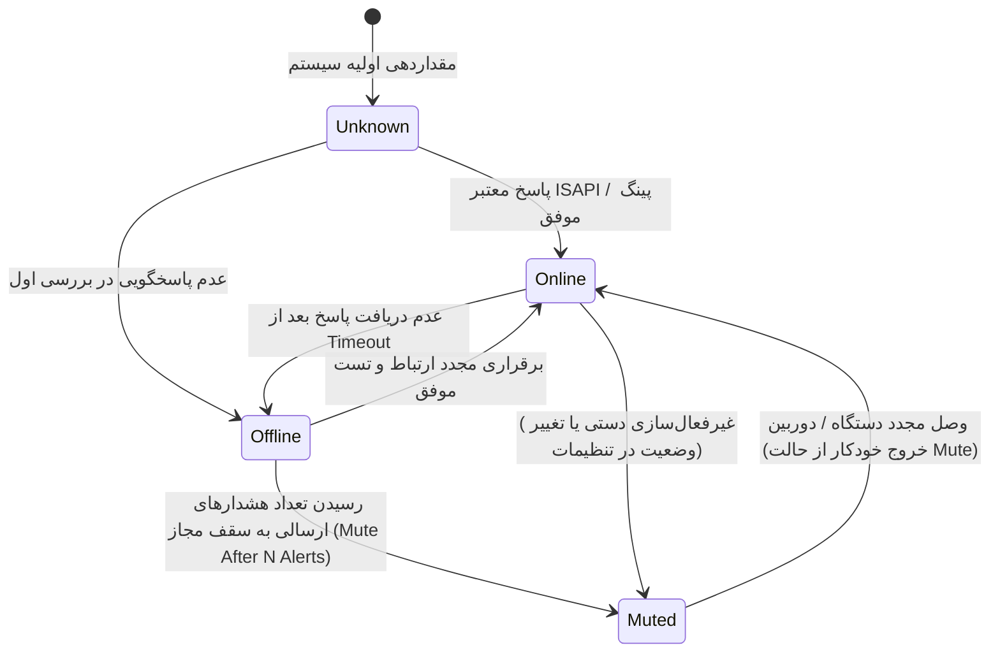
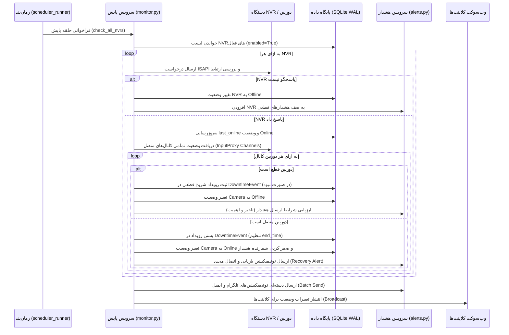

# 🔄 مستند منطق مانیتورینگ و پایش وضعیت (MONITOR_LOGIC)

این مستند تشریح فرآیند پایش دوره‌ای، ماشین حالت (State Machine) وضعیت دوربین‌ها و دستگاه‌ها، نحوه تشخیص قطعی و بازیابی، و تعامل با سرویس هشدار در سامانه **HikStatus** است.

---

## 🧭 ۱. ماشین حالت وضعیت‌ها (State Machine)

هر دستگاه NVR و دوربین دارای یک وضعیت پایش لحظه‌ای است:

### شرح حالات:
* **`Online`:** ارتباط برقرار است و جریان ویدیو یا اطلاعات کانال با موفقیت دریافت می‌شود.
* **`Offline`:** پاسخ دستگاه قطع شده یا خطای شبکه/پروتکل رخ داده است.
* **`Muted`:** دستگاه همچنان قطع است ولی به دلیل ارسال حداکثر سقف مجاز هشدارها (`MUTE_AFTER_N_ALERTS`)، نوتیفیکیشن‌های بعدی موقتاً مسدود می‌شوند تا از آزار کاربر جلوگیری شود.
* **`Unknown`:** وضعیت هنوز استعلام نشده است (در ابتدای راه‌اندازی یا افزودن تجهیز جدید).

---

## ⏱️ ۲. چرخه پایش (Monitoring Loop)

پایش به صورت دوره‌ای توسط تسک `monitor_loop` (با فاصله پیش‌فرض قابل تنظیم، مثلاً هر ۶۰ ثانیه) در پروسه زمان‌بند اجرا می‌گردد:

---

## 🔍 ۳. قوانین و فیلترهای هوشمند هشداردهی

برای جلوگیری از ارسال هشدارهای ناخواسته یا اسپم، چندین لایه فیلتر در پایش اعمال می‌شود:

### ۳.۱. فیلتر تاخیر بر اساس اهمیت دوربین (`Importance Delay`)
هنگام قطعی دوربین، بلافاصله اعلان ارسال نمی‌شود؛ بلکه باید حداقل زمان مشخصی از قطعی گذشته باشد:
* **دوربین با اهمیت بالا (سطح ۱):** ارسال سریع هشدار پس از سپری شدن تاخیر اولیه (مثلاً ۱ دقیقه).
* **دوربین با اهمیت معمولی (سطح ۲):** تاخیر پیش‌فرض (مثلاً ۵ دقیقه).
* **دوربین با اهمیت پایین (سطح ۳):** تاخیر بیشتر (مثلاً ۱۵ الی ۳۰ دقیقه) جهت نادیده‌گرفتن قطعی‌های گذرا و موقت.

### ۳.۲. مکانیزم سقف هشدار و بی‌صدا کردن (`Mute Mechanism`)
* هر بار ارسال هشدار قطعی، فیلد `mail_alert_count` یا `telegram_alert_count` یک واحد افزایش می‌یابد.
* چنانچه تعداد به سقف تنظیم‌شده (`MAIL_MUTE_AFTER_N_ALERTS` یا `TELEGRAM_MUTE_AFTER_N_ALERTS`، پیش‌فرض ۳ بار) برسد، وضعیت به `Muted` تبدیل شده و ارسال‌های بعدی متوقف می‌شود.
* به محض بازگشت دوربین به مدار (`Online`)، شمارنده‌ها ریست شده و هشدار بازیابی ارسال می‌گردد.

### ۳.۳. تجمیع و ارسال دسته‌ای هشدارها (`Batching`)
هنگام قطعی همزمان چند دوربین یا خاموش شدن کل یک NVR، به جای ارسال چندین پیام مجزا، پیام‌ها در یک قالب تجمیعی، زیبا و فشرده (شامل نام NVR، لیست دوربین‌ها و زمان قطعی) ارسال می‌شوند.

---

## 📝 ۴. ثبت وقایع و تحلیل دلایل قطعی (Outage Analysis)

1. **مدیریت وقایع قطعی (`DowntimeEvent`):**
   - به محض تشخیص قطعی دوربین، یک رکورد با `start_time` جاری ثبت می‌شود.
   - پس از وصل مجدد، همان رکورد با ثبت `end_time` خاتمه می‌یابد.
2. **فرآیند رفع ابهام قطعی‌های طولانی (`OutageExplanation`):**
   - تسک خودکار تحلیل قطعی‌ها در روزهای تعیین‌شده، رویدادهایی که طول قطعی آن‌ها بیشتر از حد آستانه (مثلاً بیش از ۲ ساعت) بوده را استخراج می‌کند.
   - برای این موارد یک رکورد `OutageExplanation` با ضرب‌الاجل پاسخگویی (Deadline) ایجاد شده و به مدیران گروه اعلام می‌شود تا دلیل قطعی (مانند قطعی برق، حوادث عمرانی، تعمیرات) را در سیستم ثبت نمایند.
